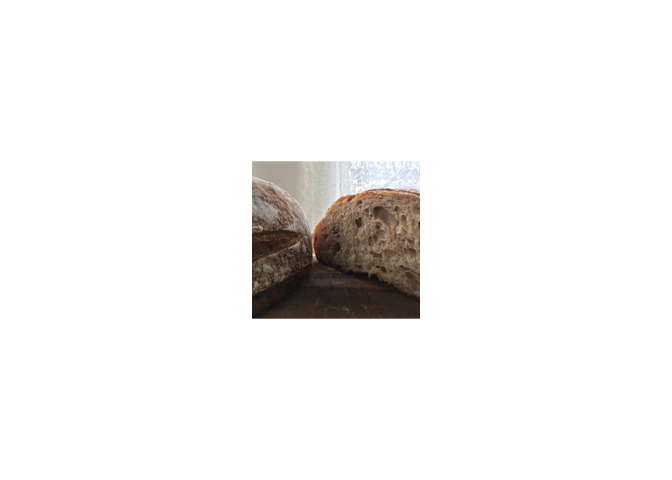
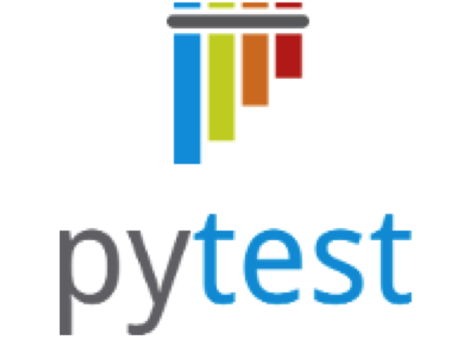

Welcome to Madpy!
=================

Organizers
==========

Madpy on Slack
==============

`slack.madpy.com` to sign up.  
`madpy.slack.com` to sign in.

Madpy meetings
==============

The suggestion box: [bit.ly/madpy-suggestions](https://bit.ly/madpy-suggestions)
================================================================================

<table>
<colgroup>
<col style="width: 100%" />
</colgroup>
<thead>
<tr class="header">
<th style="text-align: left;">What would you like to see covered at a future Madpy meetup?</th>
</tr>
</thead>
<tbody>
<tr class="odd">
<td style="text-align: left;">Alternate presentation format - Pick a dataset for the month and have people do 5-10 minute presentations on something they found interesting. For example, for police call sets, where you’d be most likely to be bitten by a coyote, etc. Might work for slower times of the year.</td>
</tr>
<tr class="even">
<td style="text-align: left;">Lightning talks (&lt;5min)</td>
</tr>
</tbody>
</table>

Next month: Thursday, December 14, 2017
=======================================

