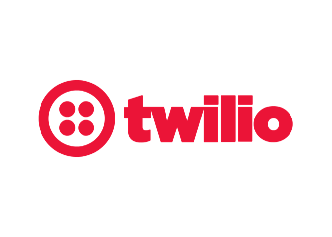

Welcome to Madpy!
=================

Organizers
==========

Sponsors
========

Sponsors
========

PerBlue

-   [Senior Data
    Analyst](https://perblue.com/Careers.aspx#op-277104-senior-data-analyst)
-   [Data
    Analyst](https://perblue.com/Careers.aspx#op-305962-data-analyst)
-   [Software Developer
    (Front-End/Tools)](https://perblue.com/Careers.aspx#op-294641-software-developer-frontendtools)

Go to
[github.com/madison-python/welcome](https://github.com/madison-python/welcome)
for links.

Code of conduct
===============

**Madpy is a community group** and open to all experience levels.  
We are committed to **a safe, professional environment.**  
**Questions and comments** supporting the speaker are encouraged.  
**Interruptions and criticisms** of the speaker are not.

[github.com/madison-python/code-of-conduct](https://github.com/madison-python/code-of-conduct)

Want more Madpy?
================

[meetup.com/madpython](https://www.meetup.com/madpython/)  
[github.com/madison-python](https://github.com/madison-python)  
[github.com/madison-python/welcome](https://github.com/madison-python/welcome)

Join us on Slack
----------------

`slack.madpy.com` to sign up.  
`madpy.slack.com` to sign in.

Subscribe to our googlegroups
-----------------------------

Send a blank email to: `madpy+subscribe@googlegroups.com`

Madpy meetings
==============

Madpy calendar
==============

-   **March 14: Flask (Whil Hentzen)**
-   April 11: Deploying a machine learning API (Devin Conathan)
-   May 9: Zendesk!
-   June 13: Python Environments (???)
-   July 11: Python Data Model (Josh Karpel)

Topics
======

**Vote one topic up in the queue, or append a new one.**

-   lighting talks on hobby projects
-   asyncio
-   microservices
-   python syntax
-   metaclasses
-   decorators
-   C-extensions
-   numba
-   cupy
