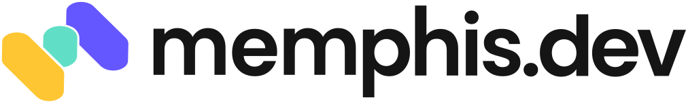

<!-- [[[cog
import cog
from nbconvert.exporters import MarkdownExporter
from nbconvert.preprocessors import RegexRemovePreprocessor

rrp = RegexRemovePreprocessor()
rrp.patterns = (r"<style>",)
e = MarkdownExporter()
e.register_preprocessor(rrp, enabled=True)
(body, resources) = e.from_filename("welcome.ipynb")
cog.out(f"\n{body}\n")
]]] -->

<h1>
Welcome to MadPy!
</h1>
 

# Organizers

<table style="border:none; border-collapse:collapse; cellspacing:0; cellpadding:0">
  <tr>
    <td></td>
    <td></td>
  </tr><tr>
    <td>
Ed Rogers
</td>
    <td>
David Hoese
</td>
  </tr>
</table>

# Sponsor

# Want more MadPy?

[**madpy.com**](https://madpy.com)  
[meetup.com/madpython](https://www.meetup.com/madpython/)  
[github.com/madison-python](https://github.com/madison-python)  
[github.com/madison-python/welcome](https://github.com/madison-python/welcome)  
[fosstodon.org/@madpy](https://fosstodon.org/@madpy)  

### Join us on Slack

[slack.madpy.com](https://slack.madpy.com) to sign up.  
[madpy.slack.com](https://madpy.slack.com) to sign in.

# MadPy Meetings

### If you have an idea for a talk you'd like to give, please reach out to Ed or Dave

# MadPy Calendar

**2nd Thursdays of the Month**
- September 14th: Snakes & Dogs: Madison Python meets at the Great Dane Hilldale
- October 5th: Joint Meetup -- MadPy + WiT (Women in Tech)
- November 9th: ???

Open to sponsorship

<!-- [[[end]]] -->
