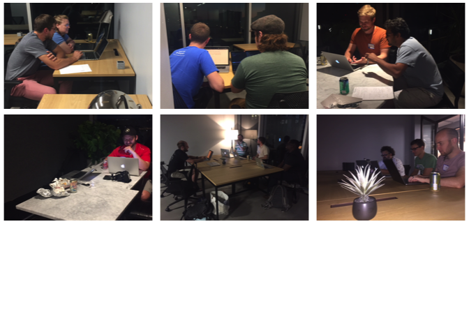

Welcome to Madpy!
=================

Organizers
==========

Code of conduct
===============

**Madpy is a community group** and open to all experience levels.  
We are committed to **a safe, professional environment.**  
**Questions and comments** supporting the speaker are encouraged.  
**Interruptions and criticisms** of the speaker are not.

[github.com/madison-python/code-of-conduct](https://github.com/madison-python/code-of-conduct)

Want more Madpy?
================

[meetup.com/madpython](https://www.meetup.com/madpython/)  
[github.com/madison-python](https://github.com/madison-python)  
[github.com/madison-python/welcome](https://github.com/madison-python/welcome)

Join us on Slack
----------------

`slack.madpy.com` to sign up.  
`madpy.slack.com` to sign in.

Subscribe to our googlegroups
-----------------------------

Send a blank email to: `madpy+subscribe@googlegroups.com`

Madpy meetings
==============

Recap
=====

-   Sept. 9: Pair programming Q&A
-   Sept. 13: Pair Night

Annoucements
============

October 18: AllDayDevOps ([alldaydevops.com](https://alldaydevops.com))

Madpy calendar
==============

-   October 4: Polyglot Bytes Lightning talks
    -   *Kotlin, Elm, Dot, Stata, underscore.js*
-   November 8: Beyond Batteries - A look at Elixir (Casey Brant)
-   December 13: Python Typings (Nick Hyatt)

2019
----

1/10, *2/7*, 3/14, 4/11, 5/9, 6/13, 7/11, 8/8, *9/5*, 10/10, 11/14,
12/12

Polyglot Bytes Lighting talks
=============================

**15 minutes!**

-   Elm
-   Kotlin
-   Dot
-   Underscore.js
-   C++
