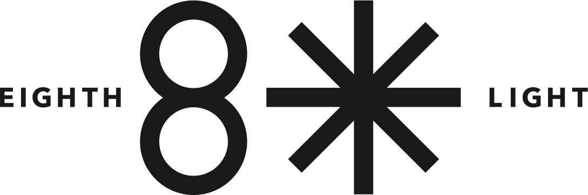

<!-- [[[cog
import cog
from nbconvert.exporters import MarkdownExporter
from nbconvert.preprocessors import RegexRemovePreprocessor

rrp = RegexRemovePreprocessor()
rrp.patterns = (r"<style>",)
e = MarkdownExporter()
e.register_preprocessor(rrp, enabled=True)
(body, resources) = e.from_filename("welcome.ipynb")
cog.out(f"\n{body}\n")
]]] -->

<h1>
Welcome to MadPy!
</h1>
 

# Organizers

<table style="border:none; border-collapse:collapse; cellspacing:0; cellpadding:0">
  <tr>
    <td></td>
    <td></td>
  </tr><tr>
    <td>
Ed Rogers
</td>
    <td>
David Hoese
</td>
  </tr>
</table>

# Code of Conduct

**MadPy is a community group** and open to all experience levels. We are committed to **a safe, professional environment**

### Ask Yourself

> Does my behavior encourage newcomers to return to future MadPy events?
>
> Would someone who has never given a presentation at MadPy before be more likely to do so in the future?

Learn more about the MadPy Code of Conduct:

https://github.com/madison-python/code-of-conduct

# Sponsor

# Want more MadPy?

<table style="border:none; border-collapse:collapse; cellspacing:0; cellpadding:0">
  <tr style="background-color: transparent; border: none;">
    <td style="border: none;"></td><td style="vertical-align: middle; border: none;"><b><a href="https://madpy.com">madpy.com</a></b></td>
  </tr>
  <tr style="background-color: transparent; border: none;">
    <td style="border: none;"></td><td style="vertical-align: middle; border: none;"><a href="https://www.meetup.com/madpython/">meetup.com/madpython</a></td>
  </tr>
  <tr style="background-color: transparent; border: none;">
    <td style="border: none;"></td><td style="vertical-align: middle; border: none;"><a href="https://github.com/madison-python">github.com/madison-python</a></td>
  </tr>
  <tr style="background-color: transparent; border: none;">
    <td style="border: none;"></td><td style="vertical-align: middle; border: none;"><a href="https://fosstodon.org/@madpy">fosstodon.org/@madpy</a></td>
  </tr>
  <tr style="background-color: transparent; border: none;">
    <td style="border: none;"></td><td style="vertical-align: middle; border: none;"><a href="https://slack.madpy.com">slack.madpy.com</a></td>
  </tr>
</table>

# MadPy Meetings

### If you have an idea for a talk you'd like to give, please reach out to Ed or Dave

# Madison Voter Life Hack

Request your absentee ballot

[https://myvote.wi.gov/en-us/Vote-Absentee-By-Mail](https://myvote.wi.gov/en-us/Vote-Absentee-By-Mail)

# MadPy Calendar

**2nd Thursdays of the Month**
<table style="width: 100%; table-layout: fixed;">
    <tr>
        <td style="width: 33%; text-align: center;">
            
        </td>
        <td style="width: 33%; text-align: center;">
            
        </td>
        <td style="width: 33%; text-align: center;">
            
        </td>
    </tr>
    <tr>
        <td style="text-align: center;">February 8th</td>
        <td style="text-align: center;">March 14th</td>
        <td style="text-align: center;">April 11th</td>
    </tr>
</table>

Open to sponsorship for future meetings

<!-- [[[end]]] -->
