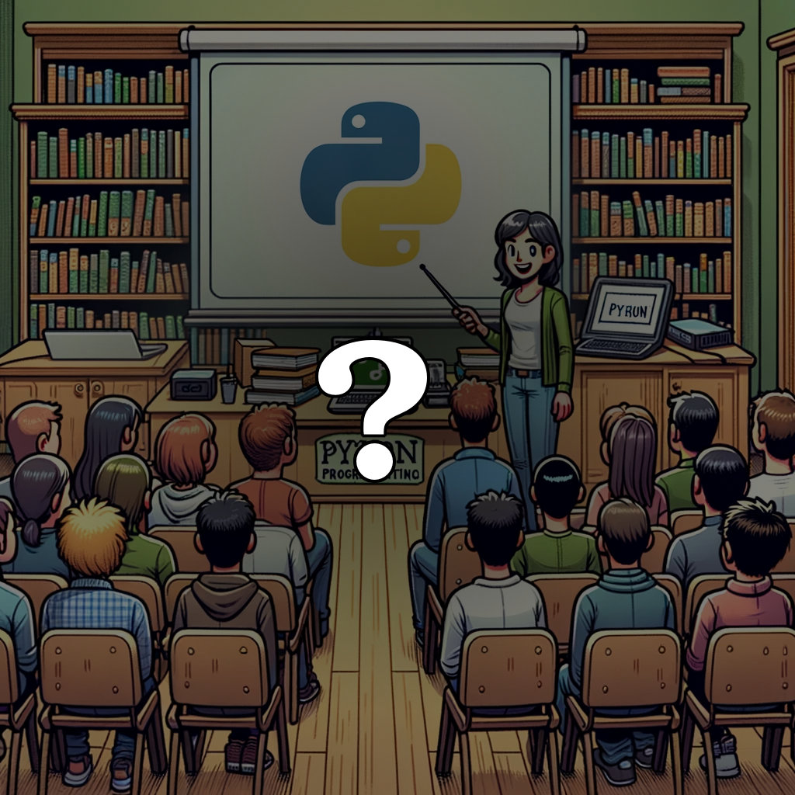

<!-- [[[cog
import cog
from nbconvert.exporters import MarkdownExporter
from nbconvert.preprocessors import RegexRemovePreprocessor

rrp = RegexRemovePreprocessor()
rrp.patterns = (r"<style>",)
e = MarkdownExporter()
e.register_preprocessor(rrp, enabled=True)
(body, resources) = e.from_filename("welcome.ipynb")
cog.out(f"\n{body}\n")
]]] -->

<h1><center>Welcome to MadPy!</center></h1>
<br>
<center></center>

# Organizers

<table style="border:none; border-collapse:collapse; cellspacing:0; cellpadding:0">
  <tr>
    <td></td>
    <td></td>
    <td></td>
  </tr><tr>
    <td><p class="caption">Ed Rogers</p></td>
    <td><p class="caption">David Hoese</p></td>
    <td><p class="caption">Josh Karpel</p></td>
  </tr>
</table>

# Code of Conduct

**MadPy is a community group** and open to all experience levels. We are committed to **a safe, professional environment**

### Our Commitment to You

We are enthusiastically focused on improving our event and making it a place that is welcoming to all. All reports will be taken seriously, handled respectfully, and dealt with in a timely manner.

Learn more about the MadPy Code of Conduct:

https://github.com/madison-python/code-of-conduct


# Python Warm-Up


```python
next_12_madpy_meetups = 12 * [
    {
        "topic": "TBD",
        "host": "Ed"
    }
]
```


```python
next_12_madpy_meetups
```


    [{'topic': 'TBD', 'host': 'Ed'},
     {'topic': 'TBD', 'host': 'Ed'},
     {'topic': 'TBD', 'host': 'Ed'},
     {'topic': 'TBD', 'host': 'Ed'},
     {'topic': 'TBD', 'host': 'Ed'},
     {'topic': 'TBD', 'host': 'Ed'},
     {'topic': 'TBD', 'host': 'Ed'},
     {'topic': 'TBD', 'host': 'Ed'},
     {'topic': 'TBD', 'host': 'Ed'},
     {'topic': 'TBD', 'host': 'Ed'},
     {'topic': 'TBD', 'host': 'Ed'},
     {'topic': 'TBD', 'host': 'Ed'}]


```python
upcoming_months = [
    "Apr", "May", "Jun",
    "Jul", "Aug", "Sep",
    "Oct", "Nov", "Dec",
    "Jan", "Feb", "Mar",
]
```

## A Logistical Challenge


```python
print("Ed needs a substitute for July")

july_index = upcoming_months.index("Jul")

print(f"July will be month {july_index}")
```

    Ed needs a substitute for July
    July will be month 3


## Let's put Josh on the spot


```python
next_12_madpy_meetups[july_index]["host"] = "Josh"
```


```python
next_12_madpy_meetups
```


    [{'topic': 'TBD', 'host': 'Josh'},
     {'topic': 'TBD', 'host': 'Josh'},
     {'topic': 'TBD', 'host': 'Josh'},
     {'topic': 'TBD', 'host': 'Josh'},
     {'topic': 'TBD', 'host': 'Josh'},
     {'topic': 'TBD', 'host': 'Josh'},
     {'topic': 'TBD', 'host': 'Josh'},
     {'topic': 'TBD', 'host': 'Josh'},
     {'topic': 'TBD', 'host': 'Josh'},
     {'topic': 'TBD', 'host': 'Josh'},
     {'topic': 'TBD', 'host': 'Josh'},
     {'topic': 'TBD', 'host': 'Josh'}]


#### Muahahaha!

## What happened?


```python
person_1 = {
    "name": "Ed",
    "role": "Host with the most",
}

person_2 = {
    "name": "Ed",
    "role": "Host with the most",
}

person_1 == person_2
```


    True


```python
person_1 is person_2
```


    False


#### Value equality isn't the only kind of equality

#### There is also "reference equality"

## Lists of Equal Things


```python
list_of_people = [person_1, person_2]

list_of_people[0] == list_of_people[1]
```


    True


```python
list_of_people[0] is list_of_people[1]
```


    False


```python
list_of_people = 2 * [person_1]

list_of_people[0] == list_of_people[1]
```


    True


```python
list_of_people[0] is list_of_people[1]
```


    True


```python
list_of_people = 2 * [person_1]

list_of_people
```


    [{'name': 'Ed', 'role': 'Host with the most'},
     {'name': 'Ed', 'role': 'Host with the most'}]


```python
list_of_people[0]["role"] = "Party animal!"
```


```python
list_of_people
```


    [{'name': 'Ed', 'role': 'Party animal!'},
     {'name': 'Ed', 'role': 'Party animal!'}]


## Review

#### Things with the same value may be held in different places in memory


```python
sum_of_cubes = sum((i**3 for i in range(10)))
current_year = 2025

sum_of_cubes == 2025
```


    True


```python
sum_of_cubes is current_year
```


    False


#### Just because values are equal doesn't mean their references are

## Take Home Challenge


```python
number_of_months_in_2025 = 12
num_madpy_events_in_2025 = 12

number_of_months_in_2025 is num_madpy_events_in_2025
```


    True


😵‍💫

# Sponsor

<center></center>

# Want more MadPy?


<table style="border:none; border-collapse:collapse; cellspacing:0; cellpadding:0">
  <tr style="background-color: transparent; border: none;">
    <td style="border: none;"></td><td style="vertical-align: middle; border: none;"><b><a href="https://madpy.com">madpy.com</a></b></td>
  </tr>
  <tr style="background-color: transparent; border: none;">
    <td style="border: none;"></td><td style="vertical-align: middle; border: none;"><a href="https://www.meetup.com/madpython/">meetup.com/madpython</a></td>
  </tr>
  <tr style="background-color: transparent; border: none;">
    <td style="border: none;"></td><td style="vertical-align: middle; border: none;"><a href="https://github.com/madison-python">github.com/madison-python</a></td>
  </tr>
  <tr style="background-color: transparent; border: none;">
    <td style="border: none;"></td><td style="vertical-align: middle; border: none;"><a href="https://fosstodon.org/@madpy">fosstodon.org/@madpy</a></td>
  </tr>
  <tr style="background-color: transparent; border: none;">
    <td style="border: none;"></td><td style="vertical-align: middle; border: none;"><a href="https://slack.madpy.com">slack.madpy.com</a></td>
  </tr>
  <tr style="background-color: transparent; border: none;">
    <td style="border: none;"></td><td style="vertical-align: middle; border: none;"><a href="https://linkedin.com/company/madpy">linkedin.com/company/madpy</a></td>
  </tr>
</table>


# The Best Way to Help MadPy

### Talk to your employer about Sponsorship!

# MadPy Calendar

**2nd Thursdays of the Month**
<table style="width: 100%; table-layout: fixed; border:none; border-collapse:collapse; cellspacing:0; cellpadding:0">
    <tr>
        <td style="width: 35%; text-align: center;">
            
        </td>
        <td style="width: 26%; text-align: center;">
            
        </td>
        <td style="width: 39%; text-align: center;">
            
        </td>
    </tr>
    <tr>
        <td style="text-align: center;">April 10th</td>
        <td style="text-align: center;">May 8th</td>
        <td style="text-align: center;">June 12th</td>
    </tr>
</table>


<!-- [[[end]]] -->
